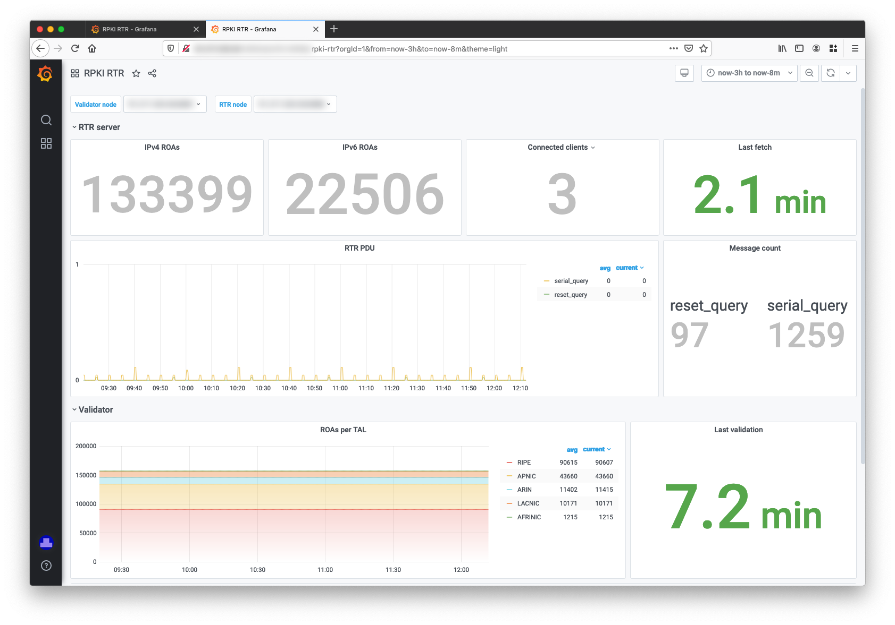
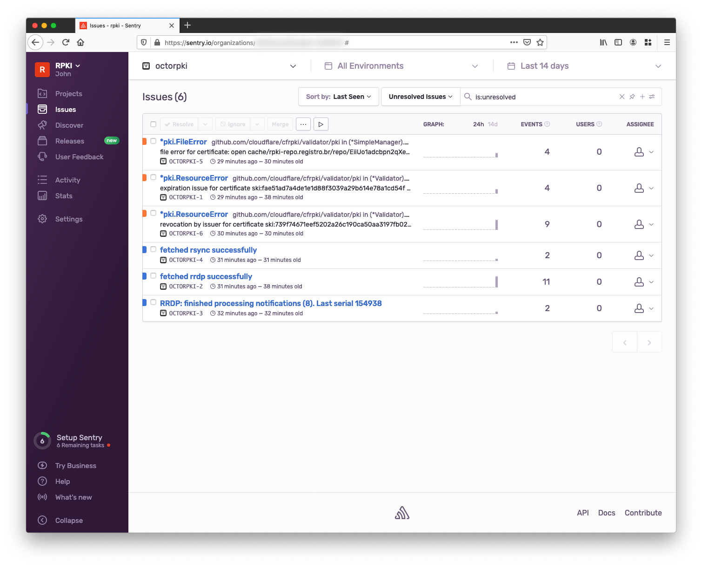
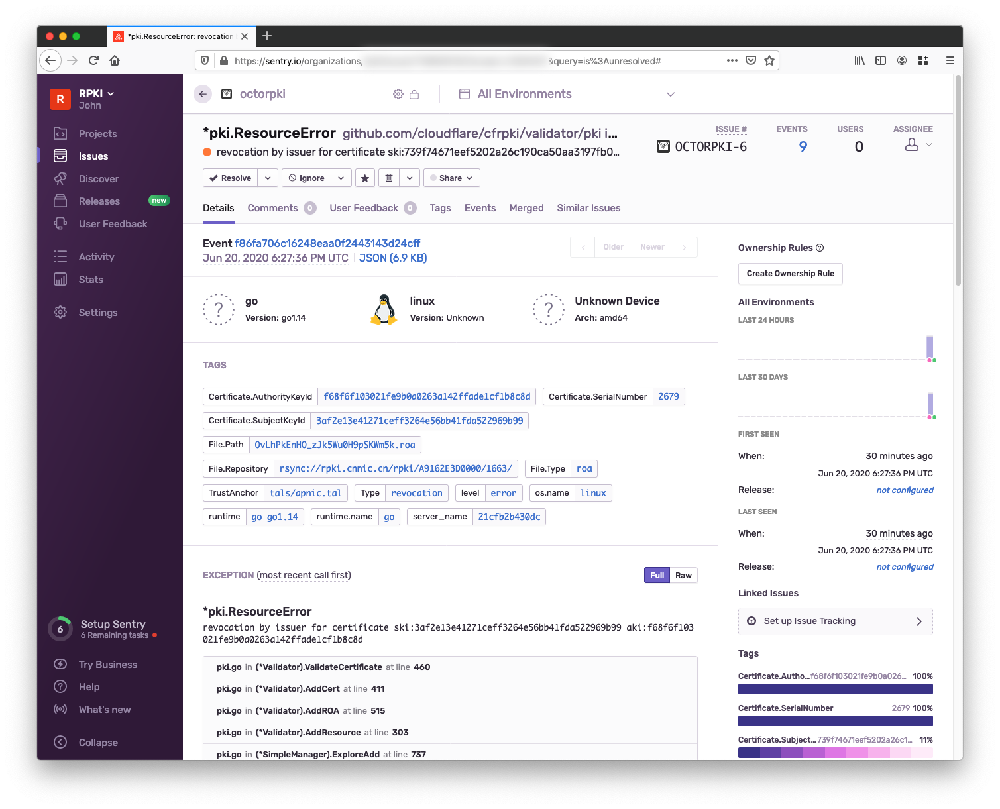
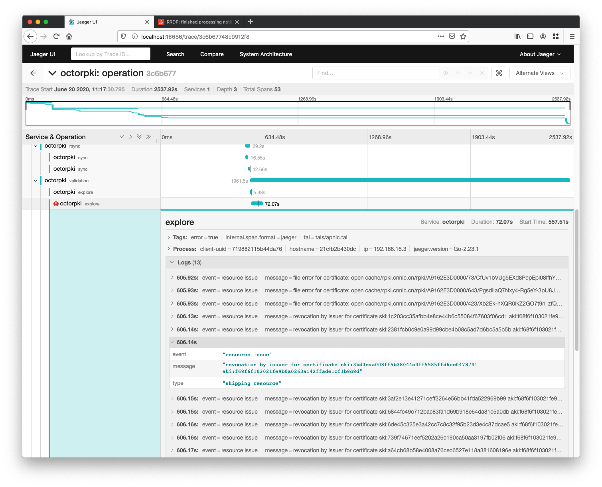
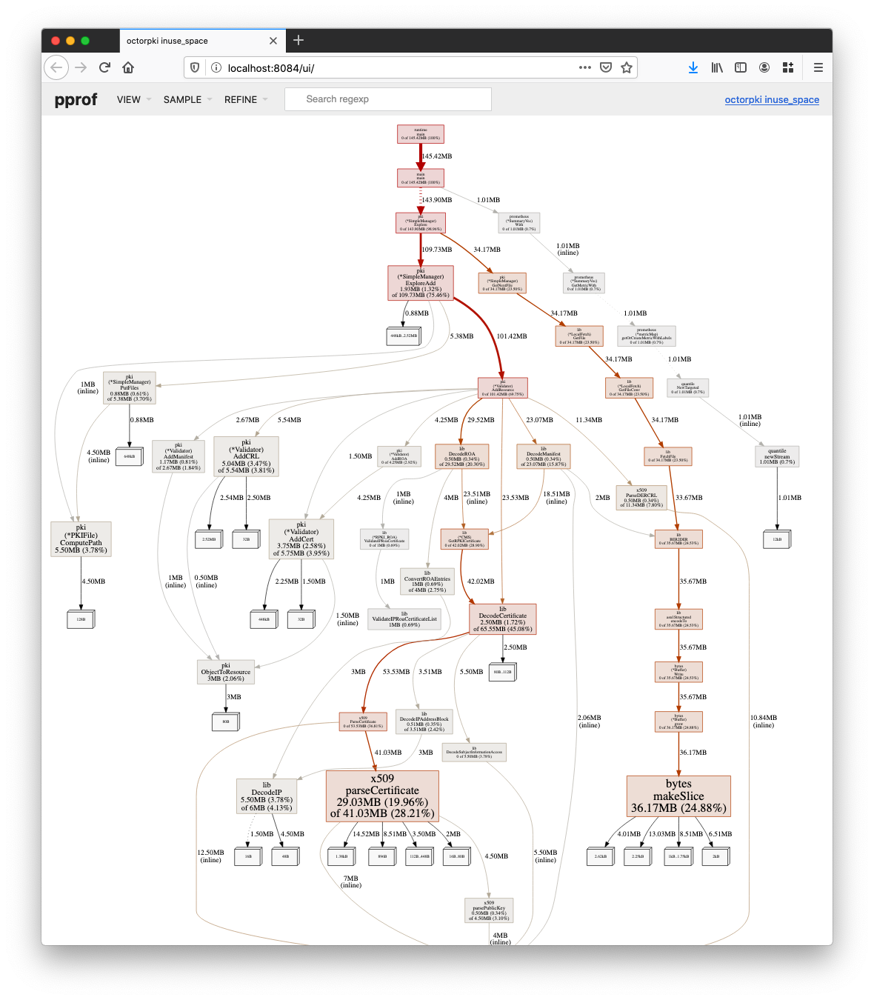
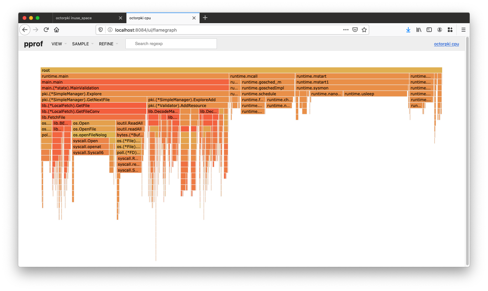

# Monitoring

The most requested feature is visibility into the validation data.
This document covers basic monitoring and health of the toolings
(OctoRPKI and GoRTR) but also advanced features like distributed tracing
and extended logging systems.

While all the tools are optional, we recommend to setup mininmal
monitoring with Prometheus.
The sections below will go from a simple general use-case to
more specific, development-centric data.

You can usually find the tools listed here in use inside many tech companies.
While it may feel superfluous and complex to set them up _just_
for the use of RPKI, it may be fruitful to reach out to development-focused
teams and use previously installed software.

A quick note on the Cloudflare RPKI Dashboard and API as it also
fits in the *monitoring* part of RPKI.
A custom version of OctoRPKI is providing the data behind
[rpki.cloudflare.com](https://rpki.cloudflare.com) and its GraphQL API.
It includes fingerprints, file-specific information, historical data
and also validation status of the BGP data collected.
Unfortunately, the setup is too specific to Cloudflare to be made open-source.
Work is being done in that direction to provide a limited feature-set plug and play
dashboard. A section will be added later on.

## Play with docker-compose

In the `compose` folder, there is a configuration file that can be used
to start a RPKI validation environment with monitoring.
Make sure [docker](https://docs.docker.com/get-docker/) and 
[docker-compose](https://docs.docker.com/compose/install/) are installed on your machine.

This should provide an effortless demo of all the pieces fitting together:
- 2 GoRTR (one connected to the local OctoRPKI)
- 1 OctoRPKI
- 1 Prometheus
- 1 Grafana (provisions RPKI dashboard)
- 1 Jaeger

You can start with `docker-compose up`.
The Grafana is available on http://localhost:3000 (user/pass: admin/admin).
Jaeger interface is on http://localhost:16686.
You can connect RTR clients to localhost:8282 and localhost:8283.

## Graphs with Prometheus and Grafana

[Prometheus](https://prometheus.io/docs/introduction/overview/#what-is-prometheus) is an
open-source monitoring and alerting system widely used in the devops community.

Its configuration file indicates HTTP endpoints that Prometheus will scrape on a periodic
basis.

Both OctoRPKI and GoRTR have Prometheus-scrappable endpoints.
If you are running them on your local machine:
* GoRTR http://localhost:8080/metrics
* OctoRPKI http://localhost:8081/metrics

If you look at the data returned, you can find metrics like:
```
rpki_roas{filtered="filtered",ip_version="ipv4",path="https://rpki.cloudflare.com/rpki.json"} 132204
rpki_roas{filtered="filtered",ip_version="ipv6",path="https://rpki.cloudflare.com/rpki.json"} 21923
```

The metric name is `rpki_roas`, the labels are `filtered,ip_version,path` and the value is the last number.
Once Prometheus has scraped it, it's inserted in its database timestampped with the query time.

You can access the data from Grafana using the Prometheus data source.
Grafana is an open-source visualization and analytics software.
The pre-made [dashboard 12501](https://grafana.com/grafana/dashboards/12501)
can be imported and used .

<p align="center">
  
</p>

## Error logging with Sentry

[Sentry](https://sentry.io/) is an open-source application that provides
a error and events monitoring. It is also available as a cloud-service.

The advantage of this tool is to provide an interface and search engine for logs.
Stacktrace, URIs or even tags can be used to enrich log events and help sorting and grouping.
It is more flexible than exploring console stdout/stderr messages.
This was shown to be particularly useful when investigating a cryptographically invalid resource
and troubleshoot reachability issues.

It requires Sentry-specific software code in order to provide more information.
OctoRPKI is compatible and uses the official library that wrap the errors.
When a validation error happens, information like file path and certificate key id are
added to the log before being sent to Sentry.

By passing the environment variable `SENTRY_DSN=https://<key>@<organization>.<server>/<project>`,
or the CLI argument `-sentry.dsn https://...` OctoRPKI will connect to the Sentry instance and send its messages.
It alsos include validation failures and fetching informmation (RRDP, rsync).

<p align="center">
  
</p>

<p align="center">
  
</p>

If you are new to Sentry, to get started, you can setup
[sentry/onpremise](https://github.com/getsentry/onpremise),
which uses docker-compose.

Another solution is to create a account on [sentry.io](https://sentry.io/pricing/).
The free/developer account should allow you to run a validator
within the quotas.

Proceed by creating a Project and obtain DSN to pass to the application.
You can use it with the docker-compose provided:
`SENTRY_DSN=https://... docker-compose up`.

## Distributed tracing with Jaeger

[Distributed tracing](https://opentracing.io/docs/overview/what-is-tracing/)
allows visualization of events with relational graphs and waterfal charts.
It is heavily used for microservices and complex distributed environments.
While a RPKI validator is a monolithic application, it fetches data from
many endpoints. Timing visualizations can help discovering issues
and possible optimizations.

The tracer front-end and library used in this project is
[Jaeger](https://www.jaegertracing.io/), an application developed by Uber.

To enable tracing, pass the flag `-trace=true` to enable Jaeger tracing.
The following [environment variables](https://github.com/jaegertracing/jaeger-client-go#environment-variables)
are required:
- `JAEGER_ENDPOINT=http://jaeger:14268/api/traces`
- `JAEGER_SERVICE_NAME=octorpki`
- `JAEGER_SAMPLER_TYPE=const`
- `JAEGER_SAMPLER_PARAM=1`
- `JAEGER_REPORTER_LOG_SPANS=true`

Once you connect to the dashboard, you will be able to see the status of the validation
and steps/iterations with errors.

<p align="center">
  
</p>

_Please note that some installations may use a specific flavor of open-tracing (eg: different protocols).
Some code changes may be required in order to be made compatible. This is unfortunately not possible
with configuration flags._

## Profiling usage with Pprof

This last part is more focused on the software development than proper operational
monitoring. It can be helpful identifying an issue with the code.

Profiling gives information about resource usage per function calls.

To enable profiling, pass the CLI argument `-pprof=true`.
OctoRPKI web interface will now provide new information on http://localhost:8081/debug/pprof/.

Use `go tool pprof` to connect remotely and open a web interface with charts

```bash
$ go tool pprof -http :8084 http://localhost:8081/debug/pprof/profile
```

<p align="center">
  
</p>
<p align="center">
  
</p>