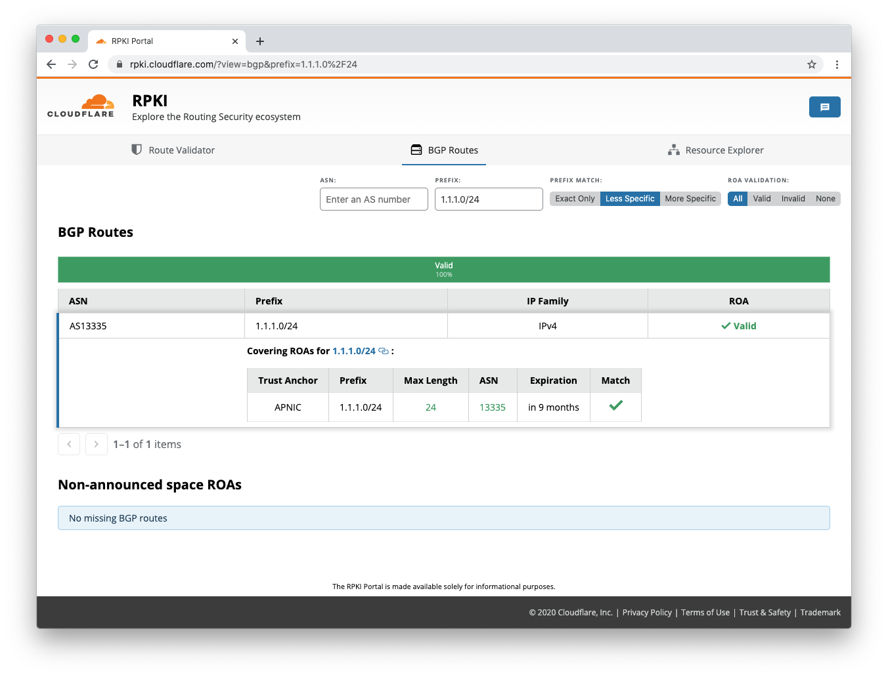

# Cloudflare RPKI Validator Tools and Libraries

## DEPRECATION NOTICE
**This software is no longer maintained. We advise replacing your production use of this software with the swap-in replacement [rpki-client](https://rpki-client.org/)**

[](https://github.com/cloudflare/cfrpki/actions?query=workflow%3AGo)


_cfrpki_ is a collection of tools and libraries to perform RPKI relying party software
operations.

This is the home of the **OctoRPKI validator**.

To get started with Cloudflare's Relying Party software, go to the section **[OctoRPKI](#octorpki)** 🐙.

<br>

## Disclaimer

_This software comes with no warranties._

## Getting started

### Introduction

A RPKI validator performs cryptographic validation on the RPKI data provided
by the Regional Internet Registries (RIR).
Every network can verify that the routing information data (prefixes and ASN)
was not tampered with.

Cloudflare develops and uses OctoRPKI. It is the data provider behind
<https://rpki.cloudflare.com/> (including the [rpki.json](https://rpki.cloudflare.com/rpki.json)).
It is also used in production by multiple networks.

<p align="center">
  <a href="https://rpki.cloudflare.com/?view=bgp&prefix=1.1.1.0%2F24">
    
  </a>
</p>

### OctoRPKI

OctoRPKI requires bootstrap file in order to fetch the RPKI data.
The Trust Anchor Location (TAL) indicates endpoints (rsync/https) hosted
by Internet Resources holders (IP addresses and ASN), the RIRs.
By default, ARIN, _Afrinic, APNIC, LACNIC and RIPE_ TALs are [shipped with this
software](https://github.com/cloudflare/cfrpki/tree/master/cmd/octorpki/tals).

This application periodically refreshes the data provided by the RIRs and the delegated organizations.
It keeps exploring the RPKI repositories until it reaches a stable state (no new endpoints added).
By default, when unstable, the server will return `503` in order to avoid distributing partial data.

The initial cold start require a few iterations which take 5 to 10 minutes (around 500MB are downloaded).
A refresh is much faster.

- Fetching root certificate listed in TAL
- Fetching repositories listed in the root certificates (RRDP and rsync)
- Fetching sub-repositories (National Internet Registries and delegated organizations)

Once it reaches a stable state, it generates a JSON list of Route Object Authorization (ROA).
A ROA associates an IP prefix with an ASN that is allowed to announce the route via BGP.
By default it is available on `http://localhost:8081/output.json`.
The current file size is around 20MB.

To use this tool with your network devices, you need to connect a RTR server
which will read the JSON.
It is officially supported by [GoRTR](https://github.com/cloudflare/gortr).

The list can be signed using ECDSA signatures to be redistributed more securely
(via a CDN or caches).

Metrics are provided on `/metrics` Prometheus endpoint.

To install the validator, you have multiple options:

- Fetch a binary/packages on the [Releases page](https://github.com/cloudflare/cfrpki/releases)
- Use Docker
- Compile it

#### Binaries/packages

First, go to the [Releases](https://github.com/cloudflare/cfrpki/releases) tab,
download the latest version matching your platform.

To install the Linux deb package and start it:

```bash
$ sudo dpkg -i octorpki_1.1.4_amd64.deb
$ sudo systemctl start octorpki
```

You can get the logs using:

```bash
$ sudo journalctl -fu octorpki
```

Please note the configuration parameters are in `/etc/default/octorpki`.
They match the CLI arguments (`$ octorpki -h` to list them).

For instance, if you want to change the port:

```bash
sudo echo OCTORPKI_ARGS=-http.addr :8081 | sudo tee /etc/default/octorpki
```

Do not forget to add the ARIN TAL: `/usr/share/octorpki/tals/arin.tal`

If you fetch a standalone binary (eg: `octorpki-v1.1.4-linux-x86_64`),
by default, it will fetch the TALs in `./tals` folder and use `./cache`
to store the RPKI repository data.
Make sure you download put all the TALs in the correct folder.

Once OctoRPKI completed its first validation, you can access the
ROAs list at the following address: <http://localhost:8081/output.json>.

By default, the validator is configured to sign the output.
We advise that you generate an ECDSA key. Follow the instructions in the
[GoRTR](#GoRTR) section.
You can disable the signature by passing `-output.sign=false` to the program.

#### Docker

OctoRPKI is available a docker container. Add the TAL files in the `tals/` folder.

```bash
$ mkdir tals && mkdir cache && touch cache/rrdp.json
$ chmod 770 -R tals && chmod 770 -R cache && chmod 770 cache/rrdp.json
$ docker run -ti --net=host -v $PWD/tals:/tals -v $PWD/cache:/cache -p 8081:8081 cloudflare/octorpki
```

Depending on your Docker configuration, you may need to specify `--net=host`
and set permissions for the files in order to avoid errors.

Using the default settings, you can access the generated ROAs list on
<http://localhost:8081/output.json>.

#### Compile

The source of OctoRPKI is in the folder `cmd/octorpki`.
Make sure you have the [Go toolkit installed](https://golang.org/doc/install).

You can then build using `go build`

```
$ cd cmd/octorpki && go build
```

The binary is now available in the same directory.

Have a look at the Makefile for more targets
to compile or generate a Docker image.

#### [GoRTR](https://github.com/cloudflare/gortr)

In order to send the computed list of ROAs to the router, the router must be
connected to a cache using RTR protocol.

OctoRPKI does not embed a RTR server. Since generating list of ROAs takes a lot of compute time,
it was designed separate the distribution of files from the cryptographic operations.

[GoRTR](https://github.com/cloudflare/gortr) was created by Cloudflare to use a list of ROAs
from either OctoRPKI or similar validators able to produce a JSON file.

To connect with GoRTR **securely**, you will need to setup a private key.

```bash
$ openssl ecparam -genkey -name prime256v1 -noout -outform pem > private.pem
```

You can force OctoRPKI to use the key by passing `-output.sign.key private.pem`.

Then extract the public key

```bash
$ openssl ec -in private.pem -pubout -outform pem > public.pem
```

If OctoRPKI is running locally using the default port and file (<http://localhost:8081/output.json>), you can connect GoRTR:

```bash
$ gortr -verify.key public.pem -cache http://localhost:8081/output.json
```

To disable signing, use the following flag on OctoRPKI `-output.sign=false` and `-verify=false` on GoRTR.

The [repository's page](https://github.com/cloudflare/gortr) gives more details on how to configure network devices to use GoRTR.

## Monitor

Check [Monitoring.md](Monitoring.md) page to see how you can setup dashboards, distributed tracing and error logging.

## Develop

### Libraries

`ov` origin validation library. You can pass prefixes and it will match against ROAs.

`sync/lib` can synchronize RRDP and rsync repositories.

`validator/pki` maintains a certificate store and performs validation.

`validator/lib` decode and encode RPKI resources.

### Applications

`cmd/localrpki` performs validation against locally stored files
and generate a JSON prefix list.

`cmd/ctrpki` performs simple validation against files and send them
to a [Certificate Transparency Log](https://ct.cloudflare.com/logs/cirrus).

`cmd/octorpki` complete validator software, with RRDP and rsync.
See the section below for more information.
